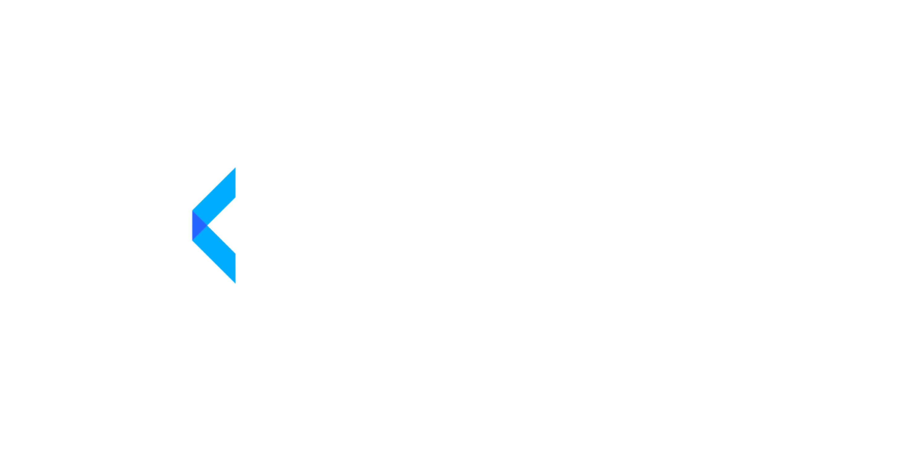

<h2 align="center" >Get a little bit richer every day.</h2>

Financeful is a personal finance web application that provides people with a better way to track and manage their money. It's an alternative to spreadsheets or traditional apps like Quicken, Mint and YNAB that can be complicated and overwhelming for new users. 

## Run locally:
This project uses Docker to create different environments that already have all the tools and services needed configured and ready to go. 

_Prerequisite: [Install Docker](https://docs.docker.com/install) on your local environment._

If you have Make installed on your OS, you can make use of the Makefile scripts to build and run the docker images. If not, the required commands are located in the Makefile in, the Server, Web, and root directories

## 1. Install dependencies locally
```
$ cd server
$ yarn install

-----------------------------------------------

$ cd web
$ yarn install
```
## 2. Build the Images 

_With make -- from the root directory_
```
$ make build-dev
```

_Without make installed_

```
$ cd web
$ docker build -t react-app -f Dockerfile.dev .

------------------------------------------------

$ cd server 
$ docker build -t server Dockerfile.dev .
```

## 3. Start the dev container

_With Make -- from the root directory_
```
$ make run-dev
```

_without make -- from the root directory_
```
$ docker-compose -f docker-compose-dev.yml up
```

## 4. Verify things are running
If you want to make sure that things are up in running you can check to see which containers are up. 

In a new terminal type 
``` 
docker ps 
```

It should output something like this:
```
CONTAINER ID   IMAGE         COMMAND                  CREATED              STATUS              PORTS                                       NAMES
a47ac3e22ac3   server        "docker-entrypoint.s…"   About a minute ago   Up About a minute   0.0.0.0:4000->4000/tcp, :::4000->4000/tcp   financeful_server_1
bc918c61c9e4   react-app     "docker-entrypoint.s…"   2 minutes ago        Up About a minute   0.0.0.0:3000->3000/tcp, :::3000->3000/tcp   financeful_react-app_1
b1f3f4f649c0   postgres:13   "docker-entrypoint.s…"   2 minutes ago        Up About a minute   0.0.0.0:5433->5432/tcp, :::5433->5432/tcp   postgres
```


## 5. Interact with the DB and GraphQL Schema

Once the development server is running, you can view the GraphQL schema at

[http://localhost:4000/graphql](http://localhost:4000/graphql)

If you want to view the contents of the DB in a GUI, open a new shell window and run these commands:

```
$ cd *your-path-to-financeful*/server
$ yarn studio
```

If for some reason the `yarn studio` throws an error, try running 
```
npx prisma studio
```

# Testing
We use Cypress to run E2E tests. The Cypress folder is located in the web directory. In order for cypress to work, both the server and the react app must be running localy. 

## Testing the API / Server
There are two types of tests that we run when testing the API: `unit` and `integration`. 

### Unit Tests
The unit tests are tests for pure functions, or anything that doesn't require a database. You can also mock the database client -- [Prisma Client](https://www.prisma.io/) -- using the Mock which can be found in `/server.testSetup.ts`.

__Note: These tests must be placed in tests/unit directory__

#### _Scripts for unit tests_

_run once_
```
yarn test:unit
```
_run in watch mode_

```
yarn test:unit:watch
```

## Integration Tests
When running integration tests, we spin up a new Database using Docker Compose, run a migration, and begin the tests. 

__Note: These test must be placed in the tests/integration directory__

#### _Scripts for integration tests_

_run once_
```
yarn test:integration
```
_run in watch mode_
```
yarn test:integration:watch
```

_Drop the docker container_
```
yarn kill:tests
```


